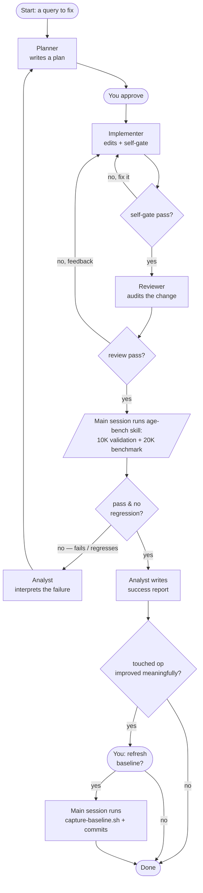

# AGE Query Agents — How to Use Them

Four helper agents and one skill handle AGE query work. You don't need to know their
internals — just pick the situation you're in and kick off the right one.

## Start here: what do you want to do?

| Your situation | Kick off | What you get back |
|---|---|---|
| "This query is too slow — make IC5 faster" | **planner** | A written plan you review and approve before any code changes. |
| "I changed a query — is it still correct?" | **reviewer** | A verdict per query: OK, FIX (a specific correction), or WATCH (slow but unavoidable). |
| "My benchmark results — what's the worst op and why?" | **results-analyst** | A ranked list of the slowest operations, each with its cause. |
| "Validation failed (and it's not IC13/IC14)" | **results-analyst** | The exact first wrong value and whether it's a real bug. |
| "The plan is approved — build it" | **implementer** | The code change, self-gated (validation + benchmark), with before/after numbers, ready for review. |
| "Just run the benchmark / validation numbers" | **age-bench** skill | The raw results to read or hand to the analyst. |

> IC13 and IC14 *always* fail validation (AGE 1.6 has no shortest-path support). That's
> expected — never treat it as a bug.

## The big picture

The core loop is a pipeline. The **planner** designs a fix; you approve it; the
**implementer** builds it and runs its own self-gate (validation + benchmark), looping on
itself until clean. A clean build then goes to the **reviewer**; review feedback bounces back
to the implementer. Only once review passes does the **main session** run the big final
quality gate through the **age-bench** skill — **10K validation + 20K benchmark**. The
**analyst** then interprets that result either way: if it fails or regresses, the analyst
explains why and it goes back to the planner for a redesign; if it passes, the analyst writes
a success report and the change is done.

## What each one does (one line)

- **Planner** — designs the fix and writes it down as a plan. Never touches code itself.
- **Implementer** — does exactly what an approved plan says, then self-gates it (build, spot-check, validation, benchmark) before handing off to review.
- **Reviewer** — checks a query against the spec and flags anything wrong. Suggests, never edits.
- **Analyst** — reads the final-gate results: on failure, explains what's slow or broken (→ planner); on success, writes the success report; if a touched op improved meaningfully, asks the main session to get your approval before refreshing the baseline.
- **age-bench** (skill) — the thing that actually runs the validation and benchmark numbers.

## The one rule that decides where things go

Every failure in the pipeline is one of two kinds, and that kind decides where it goes:

- **Execution problem** (a typo, a wrong column, a missing sort rule, a review nit) → back to
  the **implementer**, who fixes it in place. This is the tight inner loop: implementer →
  self-gate → reviewer → implementer.
- **Approach problem** (the rewrite is wrong in principle, or it validates but regresses /
  is still too slow) → back to the **planner** for a redesign. The main-session 10K
  validation + 20K benchmark is the gate that catches these; the analyst interprets the
  failure first.

So a change only reaches `Done` after it survives three gates in order: the implementer's own
self-gate, a clean review, and the main-session 10K validation + 20K benchmark with no
regression — at which point the analyst writes the success report that closes it out. If the
change improved a touched op meaningfully, the analyst flags it and the main session asks you
whether to refresh the baseline before closing; refreshing is opt-in, never automatic, so the
baseline only ratchets when you say so.
